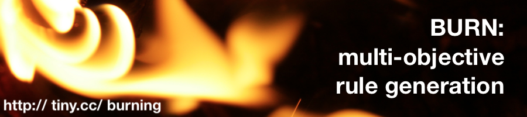

 
[home](http://tiny.cc/burning) | [code]() | [src]()

# Readme

v0.1 (c) 2018, Tim Menzies, BSD 2-clause license

Learning is not the filling  a pail, but the lighting). 

Help

cd lib

command| notes
------------ | -------------
./burn FILE   |     	run FILE.awk
./burn ed FILE |		edit FILE
./burn okay 	 |	run all tests
./burn zap 	|	delete generated files (forces recompile)
./burn pull	|	get from git
./burn push	|	send back to git
./burn license	|	show license
./burn help	|	show help

As a side-effect of running ./burn, the directory
"/Users/timm/opt/lua/burn/doc" is updated with current versions of the
html generated from the \*.lua files in this directory.

Note that this code cannot load any X.lua file for
X in ed, okay, zap, pull, push, license, help.
